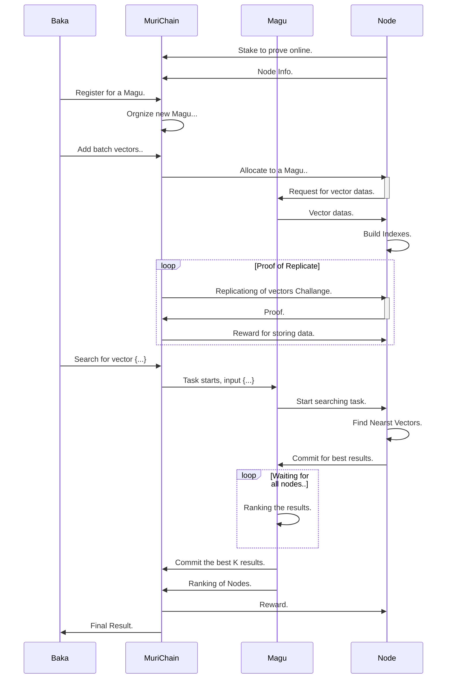

# MuriData Protocol

MuriData is a decentralized vector indexing and searching service. With blockchain providing transaction and verification ability, It allows anyone to create vector databases and send searching tasks to it.

## Technology Stack
- BlockChain
- BFT Consensus
- Consistent hashing
- Distributed Hash Table
- Distributed Computing
- Distributed Storage
- Vector Indexing (Annoy Faiss NMSLib)
- And Some Kawaii Characters (Very important!!!)

## Glossary
- **MuriData** : The general term of this system.
- **Magu** : One vector database with index.
- **MurIndexer** : Single node in a **Magu** who perform searching tasks.
- **MuriChain** : The blockchain where muridata runs on.
- **MURI** : The token of this whole ecosystem.

## Introduction
MuriData is the name of the decentralized vector searching service. It includes a blockchain to organize nodes, give incentives and allocate tasks.

With MuriData, everyone could either publish a vector database or search on existing databases. Some specialized Indexing nodes will deal with queries and reach a consensus towards the best result.

## Design

### Layer 1 : Blockchain
The MuriData will run on the base of MuriChain.
MuriChain is designed to handle the transactions of the token **MURI**, which could be used as both a payment method of searching for data and a governance tool for the whole community.
There is no special requirement for the implementation of MuriChain. It could be a fork of either Ethereum or Polkadot etc. However, to allocate tasks, it must be able to track a list of **Magu** and perform incentives and punishments, which also requires a higher scalability and speed.

### Layer 2 : Magus
**Magu** refers to the Japanese version of "mug". In MuriData this means a cluster of nodes who maintain a corresponding database. Because in order to search for a vector, nodes must store the vector data and related index data, which is impossible when the vector database is extremely large. To increase the scalability, support big data, and also prevent the single point of failure (SPOF), the searching task must be run on a number of nodes. With **Magus**, searching tasks could be finished efficiently and effectively.

### Operations

#### Publishing a Magu (Vector Database)
The database is created when an account send a transaction indicating the creation of one database, with the staking of some **MURI** Token and related data published at the network. The whole network would orgnize a **Magu** for this database and randomly choose some nodes to become its members, **MurIndexer**s. These nodes would form a small consensus group dealing with any tasks related to this database.

#### Becoming a MurIndexer
A node who wants to become a **MurIndexer** and provide indexing ability for the whole network will first stake some **MURI** with the promise of being online and store some data during a time interval. After staked some token, it would be on the list of candidates and allocated to a random **Magu**. It will start to store some vectors and perform tasks.

#### Searching for vectors
When a searching task is commited on the blockchain, the **Magu** would receive the task and start the searching process. Every **MurIndexer** would search for the nearst k vectors within its local data and send it to its **Magu**. Then all **MurIndexer**s will reach a consensus on the top k best result among those commitments and finally commit it on the blockchain. The task would finish and receive a result.

#### Fishing at Muri Network

> Fishers are the one who eventually being fished

Now Shrimp could eat the one who fish them. 

### Detalis

#### Vector Searching
A vector is [**a quantity or phenomenon that has two independent properties: magnitude and direction**](https://whatis.techtarget.com/definition/vector). In computer, it is stored as a series of numbers. 
To compare the similarity of two vectors, we need a method to calculate the distance between two vectors. There are several ways:
- Euclidean Distance
- Normalized Distance
- Hamming Distance

And also to speed up the process of searching a vector, there are many indexing methods:

- Annoy Index
- Hnsw Index

#### Distributed Computing
We could easily design a market of vector searching by simply just connect a vector searching server with its clients. However, there are several problems.

1. The vector searching server is a centralized form without any tolerance to SPOF, so the request may not be responded.
2. As a centralized server, it could not provide a searching service fast enough for use, due to the limited processing ability.
3. The result is totally controlled by just one server. There is nothing to prove the correctness of its result.

Unlike any other form of computation whose answer is definite, tasks like vector searching could only produce the nearest vector as result. Sometimes the nearest may not be find out because the index method is inaccurate. Therefore it is hard to prove that the result is the nearest. However, we could still get the answer as accurately as possible, by putting many nodes into competing:

1. Select many nodes in the network and form a smaller consensus group.
2. When task is received, every node start to work and find out the result.
3. All nodes in this group reach a consensus towards the answer by communication.

#### Distributed Storage
Just like the problems faced by distributed computing, the storage also has many difficulties to be deal with. It is inefficient to let every node store the same copy, while storing pieces of data in many node pulls the network into the risk of losing data. The way is to maintain several replications of one single piece of a data in a number of nodes, above a certain threshold. And when a node shutdown with its data, other node should rapidly get the copy of these data and store them. In MuriData system, we use **Consistent hashing** to achieve this.
All nodes joined to the small consensus group will be placed on a hash ring. Through calculation, the segment of vector database would get its location on the hash ring and then the host it will be stored on. One segment would have many replications on the hash ring. When one node quits, the data is also avaliable in other nodes. And to ensure the right number of copy exists, all node must frequently send proofs to the blockchain.
The vector database will be broken into many pieces called 'fragments', each fragment contains a merkel tree to prove the existence of a vector, and has a unique hash to identify. Also, the fragments would be allocated to all nodes through consistent hashing.

#### Distributed Hash Table
With the need of forming subgroups, nodes should be able to find and connect with each other. A DHT could be helpful.

#### Progress

## Implementation
There is no implementation now, however we already know how to do it.
[Protocol Details](Details.md)